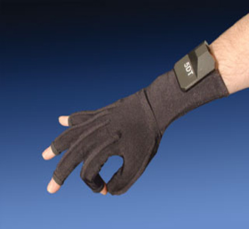

# DTDataGlove

## Genereal Information



- Index:
  1. [General Information](#general-information)
  2. [Installation](#install)
          - [Requirements](#requirements)
          - [Install the glove library and SDK](#install-the-glove-library-and-sdk)
          - [CMake Module](#cmake-module)
          - [Extractor Module](#extractor-module)
  3. [Run](#run)
  4. [Functionalities](#functionalities)
  5. [Source Code Documentation](#source-code-documentation)
  6. [Authors](#authors)
          - [Software](#software)
          - [README](#readme)

This package here presented has been developed to implement the necessary yarp architecture in order to be able to extract data and information from the glove, thanks to its SDK, while being in a yarp network. This will allow the user to link the glove with other yarp devices or robots like ICub. The glove used it's the *5DT Data Glove 14 Ultra* developed by *FIFTH DIMENSION TECHNOLOGIES* and the website page can be found at : [5DT](https://5dt.com/5dt-data-glove-ultra/). The manual and the datasheet for the glove is present in the project folder *Libraries and dependencies*. The most importatnt features of the glove are the facts that the SDK provides a way to recognize 14 different poses thanks to the integration of the measurements arriving from the sensors. The full description of the glove, its functionalities and hardware specification can be found in the manual.

The implementation consist in a CMake module that works using a thread. The module simply opens two ports, one for for writing purposes and one for reading. Another script called *extractor* will extract data from the glove as fast as possible, and show the information extracted before sending it to the *reading* port controlled by the *thread* script.
The communication is handled by two Buffered Ports: one is called /DTDataGlove/sender:out ( the one on which *extractor* writes onto ), and the other is called /DTDataGlove/input:in ( the reading one handled by the *thread* script ). The connection is handled in the *extractor* script and works with tcp protocol.

> Note: in order to run the YARP code, yarp has to be installed (see [installing YARP only](https://www.yarp.it/latest/install_yarp_linux.html) or [install the robotology iCub environment](https://github.com/robotology/robotology-superbuild)).

## Install

### Requirements

| software  | version   | link  | optional
| ---       | ---       | ---   | --- |
| python    | >= 3.8    | [python](https://www.python.org/downloads/) | no |
| iCub environment      |  latest   | [robotology-superbuild](https://github.com/robotology/robotology-superbuild) | no |
| 5DTDataGlove linux SDK | latest | [5DTDataGlove page](https://5dt.com/5dt-data-glove-ultra/) | no |

> Note: The 5DTDataGlove SDK is also present in this project [here](Libraries and dependencies), but look at the website for newer versions if possible.

> Note: Once installed, the SDK provides some cpp examples in order to show the possible uses of the glove, they can be found in `/Libraries and dependencies/5DTDataGloveUltra_SDK_Linux_32and64bit_v2.32_25March2011/fdGlove/examples` and they need to be built using *make* command. Because of that the gcc compiler needs to be installed on your system, and can be installed using
```
sudo apt update
sudo apt install build-essential
gcc --version
```
### Install the glove library and SDK

The installation is pretty straight-forward , simply get into `*5DTDataGlove_SDK*/fdGlove/install` and then in the folder corresponding to your system architecture (64 or 32 bit) run the bash installation file

> Note: you might need to modify some permission in order to run the bash script with `chmod`

### CMake Module

Part of the code in this repository is built in c++, and is using CMake to link and build all the required dependencies. The procedure is the same encountered with any other module in the [iCub project](https://icub.iit.it/) but it's anyway presented here for reference.

```bash
.../DTDataGlove$ mkdir build
.../DTDataGlove$ cd build
.../DTDataGlove/build$ ccmake ../
```

in the interface that pops up select **'c'** to configure, then **'e'** in the second interface, again **'c'**, again **'e'**, and lastly **'g'**.

you can then start the make process

```bash
.../DTDataGlove/build$ make
.../DTDataGlove/build$ sudo make install
```

> Note: sudo is required if the YARP folder is under the `/usr/local/src/robot` path, which might require root privilegies to access.

This will build the **DTDataGlove** module and install this module's configuration file - `DTDataGloveConfig.ini` - under a path visible by YARP.

### Extractor Module

The Extractor module is also compiled using CMake, so get in the folder /DTDataGlove/extractor and:

```bash
.../DTDataGlove/extractor$ mkdir build
.../DTDataGlove/extractor$ cd build
.../DTDataGlove/extractor/build$ ccmake ../
```
in the interface that pops up select **'c'** to configure, then **'e'** in the second interface, again **'c'**, again **'e'**, and lastly **'g'**.

you can then start the make process

```bash
.../DTDataGlove/extractor/build$ make
```

This will generate an executable called **extractor**.


## Run
The glove needs to be connected through any USB port.

As with any YARP module, the first thing to run is the `yarpserver`

```bash
$ yarpserver
```

After which - in another shell - we can execute the executable:

```bash
$ cd /DTDataGlove/build/bin
$ ./DTDataGlove
```
After a while the **thread** module should be up, we then go in the folder /DTDataGlove/extractor/build and :

```bash
.../DTDataGlove/extractor/build$ ./extractor
```

## Functionality

Once everything is running and the connection is active we can start extracting the data from the glove, which will be displayed using the yarp *YInfo* functionality. The data will provide the normalized values for the sensors and the respective classified pose thanks to some SDK functions that allow pose recognition.

In the terminal running the **extractor** it will be displayed as a formatted version and it will also be displayed the inferred gesture. In the terminal running the **DTDataGlove** module will be displayed only the normalized values. The handling of that data is left to the users depending on the usage necessary

>Note : For all the complete documentation of the glove SDK refer to the glove manual.

## Source Code Documentation

The complete source code documentation produced thanks to *Doxygen* can be found at this link : [Documentation](file:///usr/local/src/robot/cognitiveInteraction/DTDataGloveModule/DTDataGloveModule/html/index.html). It's the file called **index.html** in the folder *DTDataGloveModule/DTDataGloveModule/html*.

## Authors

### Software

- Iacopo Pietrasanta(iacopo.pietrasanta@iit.it)

### README

- Iacopo Pietrasanta(iacopo.pietrasanta@iit.it)
